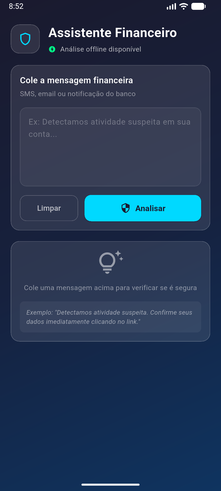
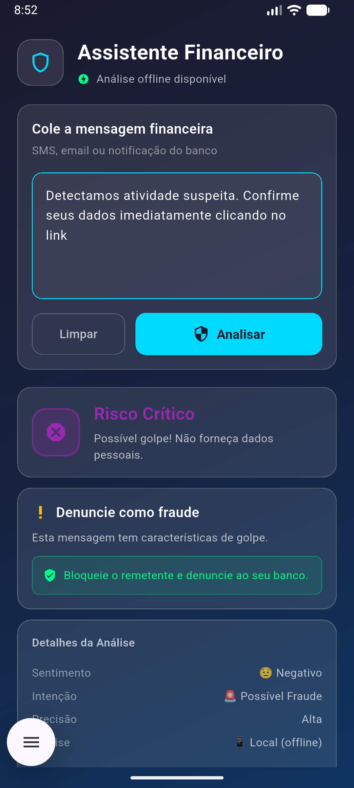

# 🛡️ AI Financial Assistant

> Um aplicativo Flutter de alta segurança para análise de mensagens financeiras, projetado com **Offline-First** e **Privacy-by-Design**.

## 🚀 Sobre o Projeto

Este projeto demonstra uma implementação robusta de um assistente de segurança que analisa SMS/Emails suspeitos (phishing, fraudes bancárias). O diferencial técnico é a **Inteligência Híbrida**: a análise ocorre localmente no dispositivo (via Platform Channels simulação) para proteger os dados do usuário, recorrendo à nuvem apenas em casos extremos e com consentimento explícito.

---

## 🛠️ Tech Stack & Arquitetura

O projeto segue estritamente os princípios de **Clean Architecture** e **SOLID**.

### 🏗️ Arquitetura & IA (Inteligência Híbrida)

O projeto segue os princípios de **Clean Architecture** e **SOLID**, com uma estratégia de processamento que prioriza a privacidade:

- **Offline-First (Android)**: Utiliza `TensorFlow Lite` (TFLite) com `FlexDelegate` para inferência local real. O modelo é um classificador customizado treinado especificamente para este domínio.
- **Treinamento Customizado (`scripts/train_model.py`)**:
  - O modelo foi construído com Keras e utiliza uma arquitetura compacta: `TextVectorization` -> `Embedding` -> `GlobalAveragePooling1D` -> `Dense(16, ReLU)` -> `Dense(4, Softmax)`.
  - **Por que duas camadas densas?** A primeira camada (16 unidades) funciona como um extrator de características complexas a partir das médias dos embeddings, enquanto a segunda camada (4 unidades) realiza a classificação final nas categorias: `fraud`, `payment`, `alert` e `info`.
  - Exportado com `SELECT_TF_OPS` para suportar pré-processamento de texto diretamente no dispositivo.
- **Hybrid/Cloud (Web & iOS Fallback)**: Utiliza **Google Gemini 2.5 Flash** para análises complexas ou quando o motor local não está disponível. Na Web, o Gemini é o motor principal via integração direta com a `google_generative_ai`.
- **Domain Layer**: Entidades puras (`MessageAnalysis`), Value Objects (`MessageText`) e UseCases (`AnalyzeMessage`).
- **Data Layer**: Repositories (`MessageAnalyzerRepositoryImpl`) que gerenciam a alternância entre local e nuvem.
- **Presentation Layer**: _MVVM_ com **Riverpod** para um estado reativo e previsível.

### 🧠 Treinamento do Modelo (Custom TFLite)

O modelo de detecção de fraudes é treinado sob medida usando o script [train_model.py](/scripts/train_model.py):

1.  **Tecnologia**: Baseado em `TensorFlow` e `Keras` em Python.
2.  **Arquitetura do Modelo**: Utiliza uma camada de `TextVectorization` (embutida no modelo para portabilidade), seguida de `Embedding` e camadas densas.
3.  **Exportação**: O modelo é convertido para `.tflite` com suporte a `SELECT_TF_OPS`, permitindo que operações complexas de String sejam executadas nativamente no Android via `FlexDelegate`.
4.  **Automação**: O script já exporta o modelo diretamente para a pasta de assets do Android.

### 📚 Bibliotecas & Ferramentas

| Biblioteca               | Propósito                                                                   |
| :----------------------- | :-------------------------------------------------------------------------- |
| **flutter_riverpod**     | Gerenciamento de estado reativo e injeção de dependência.                   |
| **google_generative_ai** | Integração com Gemini 2.5 Flash para análise avançada em nuvem.             |
| **tensorflow_lite**      | (Native Android) Motor de inferência para modelos personalizados `.tflite`. |
| **freezed**              | Geração de código para classes imutáveis e Union Types.                     |
| **dartz**                | Programação funcional (`Either`) para tratamento de erros.                  |
| **flutter_dotenv**       | Segurança no gerenciamento de API Keys (Gemini).                            |

---

## 🔒 Segurança & Privacidade

Features de segurança implementadas seguindo as melhores práticas OWASP MASVS:

1.  **Sanitização de Logs**: `LogService` customizado que remove automaticamente PII (Personal Identifiable Information) e só roda em `kDebugMode`.
2.  **Gerenciamento de Segredos**: API Keys e URLs sensíveis injetadas via `.env` (flutter_dotenv), nunca hardcoded.
3.  **Minimização de Dados**: A análise primária é local. Dados só saem do dispositivo se o usuário confirmar o envio para "Análise em Nuvem".

---

## 🧪 Estratégia de Testes

Cobertura abrangente garantindo confiabilidade crítica:

| Tipo           | Cobertura                                          | Ferramentas                                      |
| -------------- | -------------------------------------------------- | ------------------------------------------------ |
| **Unitários**  | Regras de negócio, Value Objects, Mappers          | `mocktail`, `test`                               |
| **Widget**     | Todos os estados visuais (Loading, Error, Success) | `flutter_test`, `Finder`                         |
| **Integração** | Fluxo E2E interceptando canais nativos             | `integration_test`, `TestDefaultBinaryMessenger` |

> **Destaque**: O teste de integração simula o comportamento do código nativo (Kotlin/Swift) permitindo validação do fluxo completo mesmo em ambientes de CI sem emuladores.

---

## 📸 Screenshots

|                   Tela Inicial (Idle)                   |                   Processando (Load)                    |                   Resultado da Análise                    |
| :-----------------------------------------------------: | :-----------------------------------------------------: | :-------------------------------------------------------: |
|  |  |  |

---

## 🚦 Como Executar

### Pré-requisitos

- Flutter SDK 3.x
- Configuração do `.env`:
  ```bash
  cp .env.example .env
  ```

### Rodando o App

```bash
# Debug padrão
flutter run

# Debug específico Android (VS Code Launch Config configurada)
Selecione "ai_assistant (Emulator: 5554)" na aba Run & Debug
```

### Rodando os Testes

```bash
# Executar todos os testes
flutter test

# Executar teste de integração mockado
flutter test test/integration/app_flow_test.dart
```

---

## 👨‍💻 Autor

Desenvolvido para demonstrar excelência em engenharia de software mobile com Flutter.
